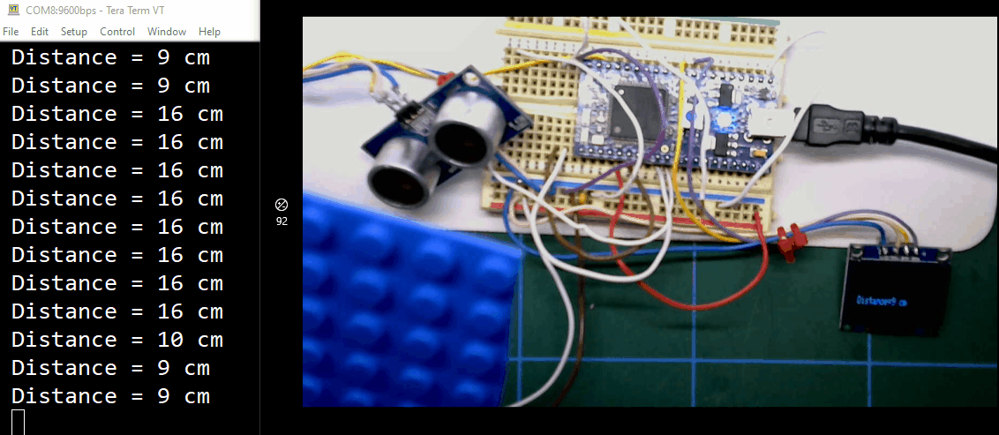
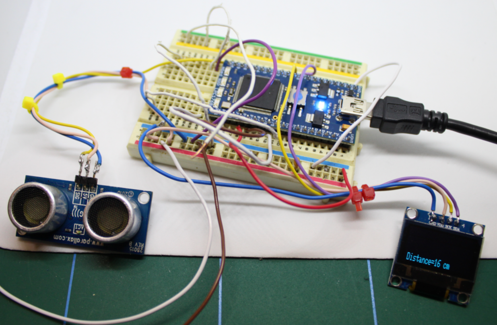
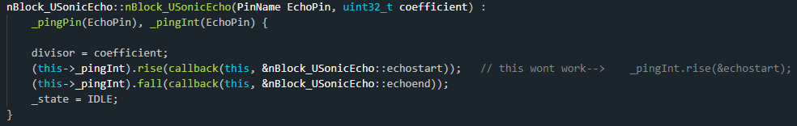

# 24D_USonicEcho_test

Testing nBlocksStudio Schematic Design for the Node [USonicEcho](https://github.com/nBlocksStudioNodes/nblocks_usonicecho)

## Interrupts in [USonicEcho](https://github.com/nBlocksStudioNodes/nblocks_usonicecho) Constructor
Using an interupt in the consructor is more complex than in a 'normal' main loop. The syntax below works and can be used in future Nodes that will need interrupts.

## Autogenerated main.cpp

## Compilation 

## Responce to the Terminal

