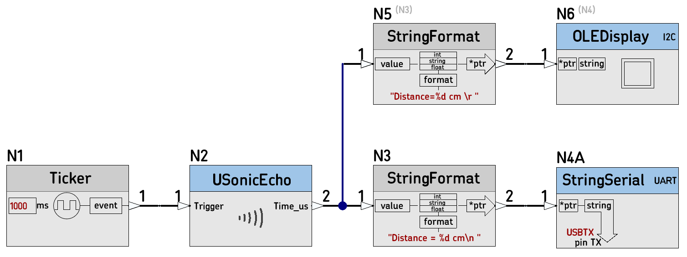
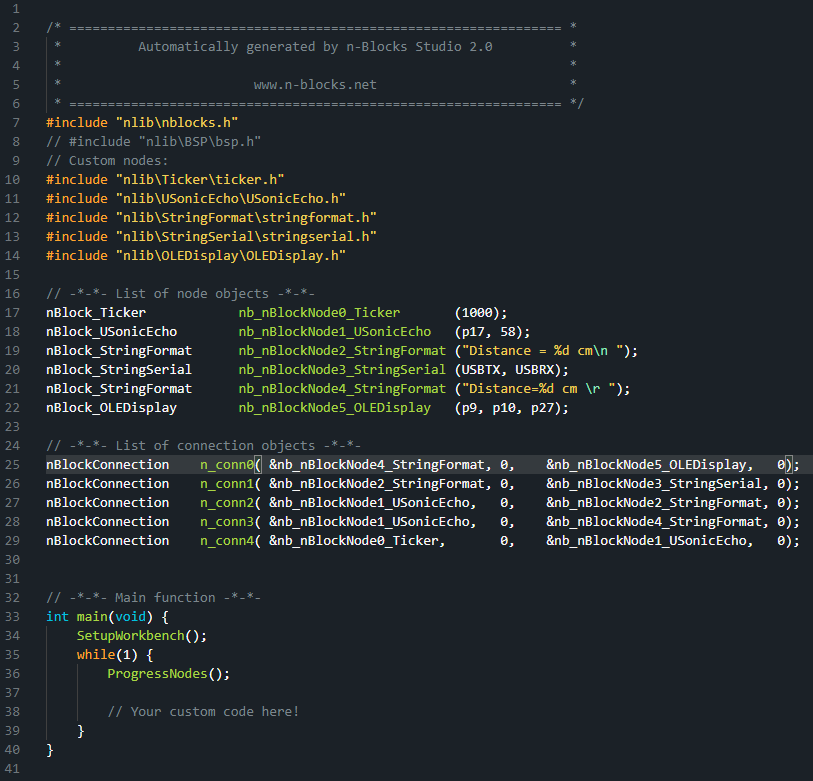

# 24D_USonicEcho_test

Testing nBlocksStudio Schematic Design for the Node [USonicEcho](https://github.com/nBlocksStudioNodes/nblocks_usonicecho)

## Autogenerated main.cpp

## Compilation 

## Responce to the Terminal

